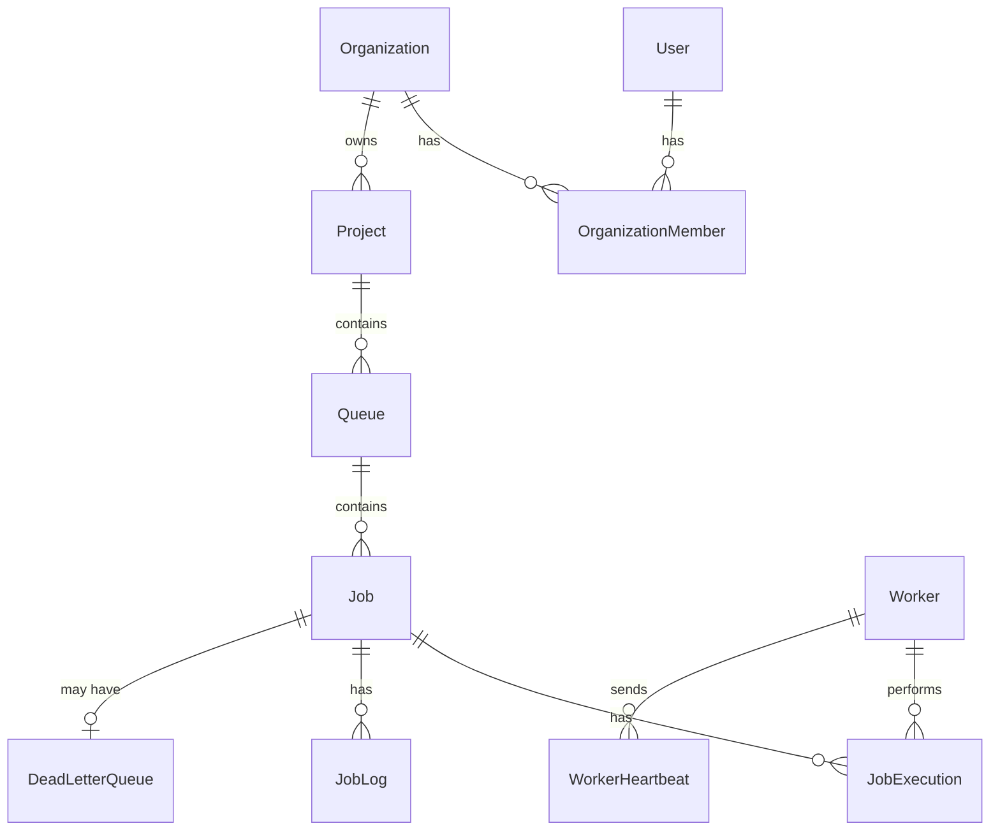

# Database Design

## ER Diagram

## Models

**User**: `id (uuid, PK)`, `email (unique)`, `password (bcrypt hash)`, `name`. Root of the ownership chain.

**Organization / OrganizationMember**: Join table pattern. Every user gets a default personal Organization on registration. Supports future multi-user teams without schema changes.

**Project**: Belongs to an Organization. `onDelete: Cascade` — deleting an org removes its projects.

**Queue**: Belongs to a Project. Holds default retry policy (`retryStrategy`, `maxAttempts`, `baseDelaySeconds`) and `concurrencyLimit`. Jobs can override these per-job via nullable fields.

**Job**: Central table. `status` enum drives the whole lifecycle. Composite index `[queueId, status, priority]` supports the worker's exact claim query pattern. Scheduling fields (`scheduledFor`, `cronExpression`, `nextRetryAt`) live directly on Job rather than a separate table — deliberate denormalization since all job types share one lifecycle.

**JobExecution**: One row per attempt. `worker` relation uses `onDelete: SetNull` — deleting a Worker preserves execution history.

**JobLog**: Append-only event stream (`JOB_CREATED`, `JOB_CLAIMED`, etc.) for observability.

**DeadLetterQueue**: Created only on permanent failure, via the same transaction as the job's `DEAD` status update — guarantees consistency.

**Worker / WorkerHeartbeat**: `Worker.lastHeartbeatAt` for fast lookups; `WorkerHeartbeat` for full history. Status computed on read from heartbeat staleness.

## Key Indexes
| Index | Reason |
|---|---|
| `jobs [queueId, status, priority]` | Exact pattern the worker's claim query filters/sorts by |
| `jobs [status]`, `[scheduledFor]`, `[nextRetryAt]` | Support the worker's `OR` eligibility conditions |
| `users [email]` unique | Login lookup + duplicate prevention |
| `queues [projectId, name]` unique | Prevent duplicate queue names per project |
| `workers [lastHeartbeatAt]` | Fast staleness computation across all workers |